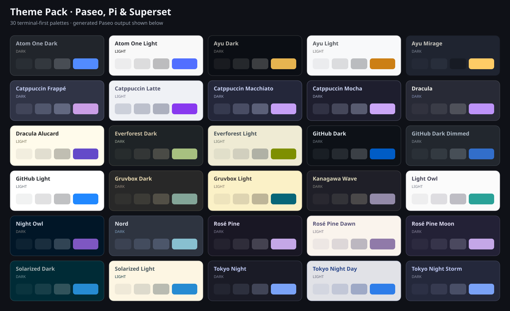

# Theme Pack for Paseo, Pi, and Superset

Thirty popular coding color schemes generated from terminal-first palettes for three agent development environments.

- **Paseo:** one static plugin using the official `plugin.addTheme()` API.
- **Pi:** one complete native TUI theme JSON per color scheme.
- **Superset:** one importable UI + terminal theme JSON per color scheme, plus an all-themes bundle.
- **Website:** a static gallery rendered from the same generated output users download.

No CSS injection, CDP, telemetry, runtime network access, install hooks, or runtime dependencies.

> **Unofficial:** This project is not affiliated with Paseo, Pi, Superset, Ghostty, iTerm2 Color Schemes, or upstream theme authors. These are semantic adaptations, not pixel-identical ports.



## Let your agent install a theme

Give your coding agent this README URL and replace the bracketed values:

```text
Read https://github.com/jzlosman/paseo-theme-pack and its linked documentation.
Install the [THEME NAME] theme for [PI, SUPERSET, OR PASEO].
For Pi or Superset, use the generated native JSON. For Paseo, install the
static plugin and select the named theme. Review the file or plugin before
installing it, preserve my existing settings, and ask before enabling plugins
or changing the active theme.
```

An agent should:

1. Confirm the requested theme and target exist.
2. Inspect the generated file or Paseo plugin before installing it.
3. Back up any destination file it would replace.
4. Install only the requested target.
5. Ask before enabling Paseo plugins or selecting a new active theme.
6. Report the changed paths and how to undo the change.

## Browse the themes

The generated gallery will be published at:

<https://jzlosman.github.io/paseo-theme-pack/>

Choose **Paseo**, **Pi**, or **Superset** to see the actual semantic colors generated for that target. Select a theme to download its native file or copy a target-specific agent prompt.

## Install manually

### Paseo

Requires Paseo 0.6.1 or newer.

```bash
git clone https://github.com/jzlosman/paseo-theme-pack.git
cd paseo-theme-pack
paseo plugin install "$PWD"
paseo plugin ls
```

If `paseo` is not on your `PATH` on macOS:

```bash
/Applications/Paseo.app/Contents/Resources/bin/paseo plugin install "$PWD"
```

Then open **Settings → Plugins**, enable plugins if needed, and choose a generated theme under **Settings → Appearance**.

Remove it with:

```bash
paseo plugin remove paseo-theme-pack
```

Paseo falls back to its default theme if the plugin disappears.

### Pi

Download one file from [`dist/pi/`](dist/pi/) into Pi's global theme directory:

```bash
theme_dir="$HOME/.pi/agent/themes"
destination="$theme_dir/nord.json"
backup="$destination.before-theme-pack"
temporary="$(mktemp)"

mkdir -p "$theme_dir"
curl -fsSL \
  https://raw.githubusercontent.com/jzlosman/paseo-theme-pack/main/dist/pi/nord.json \
  -o "$temporary"
python3 -m json.tool "$temporary" >/dev/null

if test -e "$destination" && ! test -e "$backup"; then
  cp -p "$destination" "$backup"
fi
mv "$temporary" "$destination"
```

Run `/reload` if Pi is already open, then select the theme through `/settings`.

To undo the installation, restore the backup when one exists; otherwise remove the downloaded theme:

```bash
destination="$HOME/.pi/agent/themes/nord.json"
backup="$destination.before-theme-pack"
if test -e "$backup"; then
  mv "$backup" "$destination"
else
  rm -f "$destination"
fi
```

Each generated Pi file defines every required TUI token, including message surfaces, tool states, Markdown, syntax highlighting, thinking levels, Bash mode, and HTML export colors.

### Superset

Download one theme from [`dist/superset/`](dist/superset/) or download [`all-themes.json`](dist/superset/all-themes.json).

Import through the CLI:

```bash
superset settings theme import /absolute/path/to/nord.json
superset settings theme set theme-pack-nord
```

Or open **Settings → Appearance → Theme**, click **Import Theme**, select the downloaded JSON, and choose the imported theme from the grid.

To undo the installation, switch away from the custom theme before removing it:

```bash
superset settings theme set system
superset settings theme remove theme-pack-nord
```

Superset accepts a single theme, an array, or `{ "themes": [...] }`. The generated files include both application UI and terminal ANSI colors.

## Themes

| Family | Included variants |
| --- | --- |
| Catppuccin | Latte, Frappé, Macchiato, Mocha |
| Dracula | Dracula, Alucard |
| GitHub | Light, Dark, Dark Dimmed |
| Atom One | Dark, Light |
| Tokyo Night | Night, Storm, Day |
| Nord | Nord |
| Gruvbox | Dark, Light |
| Solarized | Dark, Light |
| Rosé Pine | Main, Moon, Dawn |
| Ayu | Dark, Mirage, Light |
| Night Owl | Night Owl, Light Owl |
| Everforest | Dark, Light |
| Kanagawa | Wave |

## Why terminal-first?

Editor themes often use low-contrast comment colors and nearly identical surface colors. Those roles do not safely map to functional UI text and controls. The first version of this pack made that mistake: Nord's secondary text was only `1.69:1` against its background.

The canonical records now preserve:

- background and foreground;
- cursor and cursor text;
- selection background and foreground;
- ANSI colors 0–15;
- an explicit representative accent;
- pinned UI overrides only where a hand-tuned mapping is known to work.

Target adapters then derive readable semantic roles. Generated application themes require at least `7:1` primary-text contrast and `4.5:1` functional secondary-text contrast. Raised surfaces, controls, and borders receive distinct tonal steps.

Most terminal palettes are normalized from Ghostty's bundled representation of [iTerm2 Color Schemes](https://github.com/mbadolato/iTerm2-Color-Schemes). Every record also retains its canonical upstream editor/palette source.

## Repository layout

```text
themes/themes.json          terminal-first source records
scripts/theme-pack.mjs      validation and target adapters
scripts/generate.mjs        deterministic file generator
index.ts                    generated Paseo plugin
dist/pi/                    generated Pi themes
dist/superset/              generated Superset themes
site/                       generated catalog + static gallery
docs/theme-grid.svg         generated social/README preview
```

## Develop and contribute

Node.js 22 or newer is sufficient. There are no package dependencies.

```bash
npm run generate
npm test
npm run check
```

To contribute a palette:

1. Add or update its terminal record in `themes/themes.json`.
2. Pin canonical source repositories to full commit SHAs.
3. Record source files, terminal source, and licenses.
4. Add UI overrides only when the generic adapter cannot preserve the theme's identity.
5. Generate and inspect all three target outputs.
6. Test narrow and wide application states and include screenshots.

Commercial themes, unclear licenses, logos, wallpaper, fonts, and icons are out of scope.

## Attribution and license

Adapter code and original documentation are MIT licensed. Theme names and palettes retain their upstream terms. See [THIRD_PARTY_NOTICES.md](THIRD_PARTY_NOTICES.md).
